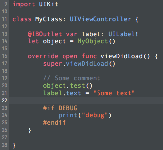

# Config

**Config** is a basic checklist I follow to set up a new Mac's development environment. It gets me up to speed with Git, Ruby, GitHub and more.

## Contents

| File | Description |
| --- | --- |
| `.bash_profile` | Customizes the Terminal.app prompt and echoes the currently checked out Git branch. |
| `.gitconfig` | Global Git configuration to specify my name and email, shortcuts, colors, and more. |
| `.gitignore` | The ignore file from [gitignore.io](https://www.gitignore.io/api/swift). |

## Checklist

### 1. Prep OS X

- Download and install latest version of Xcode from the Mac App Store.
- Download and install Xcode Command Line Tools from <https://developer.apple.com/downloads/>.

### 2. Prep Terminal

- Load [`.bash_profile`](/.bash_profile)
- Load [`.gitconfig`](/.gitconfig) contents into the global `~/.gitconfig`
- Load up the Ocean theme (instructions [below](#ocean-theme-for-terminal))
- Set up syntax highlighting by running `cd ~ ; vi .vimrc` then saving the file with `syntax on`

### 3. Prep Xcode

- Load the custom key bindings:
   1. Put [`Kevin's.idekeybindings`](Kevin's.idekeybindings) into `/Users/[username]/Library/Developer/Xcode/UserData/KeyBindings`
   2. Quit and reopen Xcode
   3. Go to **Preferences**, then to **Key Bindings** tabs
   4. Select **Kevin's** Key Bindings Set.
- Load up the custom Dark color scheme (instructions [below](#dark-color-scheme-for-xcode))

### 4. Secure Git(Hub) access

- [Generate new SSH key](https://help.github.com/articles/generating-ssh-keys/)
- [Generate an access token](https://help.github.com/articles/creating-an-access-token-for-command-line-use/) for Terminal to auth your GitHub account when 2FA is enabled.

### 5. Install Homebrew

- Install [Homebrew](http://brew.sh) with the following command:
```bash
/usr/bin/ruby -e "$(curl -fsSL https://raw.githubusercontent.com/Homebrew/install/master/install)"
```

### 6. Setup Ruby

- Install rbenv via Homebrew: `brew install rbenv`.
- Download a version of Ruby via rbenv (e.g., `rbenv install 2.2.3`). See <https://gorails.com/setup/osx/10.11-el-capitan>.
- Make it the global version of Ruby: `rbenv global 2.2.3`.

*Installing and managing Ruby with rbenv allows us to specify versions of Ruby on a per-project basis. It also means we can avoid running sudo commands for installing gems and more as it's not affecting OS X's system Ruby.*

### 7. Useful apps

#### Tools

- [SourceTree](https://www.sourcetreeapp.com): a visual Git client
- [Sublime Text](https://www.sublimetext.com): a sophisticated text editor for code, markup and prose
- [Postman](https://www.getpostman.com): a swiss army knife of API tools, allowing you to design, build, test, document and monitor your services, all in one place
- [MacDown](http://macdown.uranusjr.com) is a Markdown editor and previewer
- [Knuff](https://github.com/KnuffApp/Knuff): a debug application for Apple Push Notification Service
- [QuickRadar](http://www.quickradar.com): a tool to improve bug report flow to Apple

#### Communication

- [Polymail](https://polymail.io): a powerful platform for email productivity
- [Slack](https://slack.com): a real-time messaging, archiving and search for modern teams

#### Design

- [Sketch](https://www.sketchapp.com): a professional digital design app for Mac
- [Zeplin](https://zeplin.io): a collaboration app for UI designers and frontend developers

#### Miscelleanous

- [Flux](https://justgetflux.com): a tool that adapts the color of your computer's display to the time of the day

### 8. Additional dependencies

- Install node via Homebrew: `brew install node`.

## Ocean Theme for Terminal


This is a quick Terminal profile (color scheme) for OS X based on the [base16 Ocean theme](http://chriskempson.github.io/base16/#ocean).

If you like this theme, be sure to check out the [editor color schemes](https://github.com/chriskempson/base16-textmate) and [Spacegray UI theme](http://kkga.github.io/spacegray/) for Atom and Sublime Text.

### Usage

1. Download this repo.
2. Open up Terminal, go to **Preferences**, then **Profiles**.
3. In the bottom left, click the settings cog and select **Import...**. Navigate to the terminal-ocean-dark.terminal [`Dark.xccolortheme`](Dark.xccolortheme) file and open it.
4. Lastly, set it as your default by selecting the new profile and clicking the **Default** button.

## Dark Color Scheme For Xcode



This is a Xcode color scheme custom made.

### Usage

1. Download this repo.
2. Open up Finder, go to `/Users/[username]/Library/Developer/Xcode/UserData/FontAndColorThemes` folder.
3. Copy paste the [`Dark.xccolortheme`](Dark.xccolortheme) file there.
4. Quit and reopen Xcode.
5. Go to **Preferences**, then to **Fonts and colors** tabs.
6. Select **Dark** theme.

## Use it yourself

Fork this repo, or just copy-paste things you need, and make it your own. **Please be sure to change your `.gitconfig` name and email address though!**


## License

Licensed MIT.
Heavily inspired on [mdo/config](https://github.com/mdo/config).
